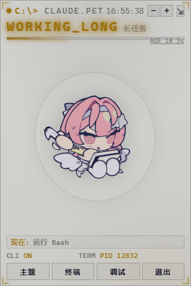

# ClaudePet · 桌面桌宠

一个**无边框真透明悬浮球**桌面宠物，实时反映 **Claude Code CLI** 的工作状态——思考中、正在跑哪个工具、等待你输入、完成、待命、离线、异常。赛博朋克 HUD，可切换主题、缩放字号、调节透明度、置顶、拖动，配置持久化。

- **看得见"在干什么"**：不只是"工作中"，而是 `运行命令 / 编辑文件 / 搜索代码 / 调用子代理…`。
- **看得见"在等你"**：claude 卡在权限确认或等你开口时，桌宠变琥珀色并提示——这是最该被提醒的时刻。
- **看得见"烧了多少"**：本次会话 / 今日 / 累计的 token 用量、缓存命中率、上下文占用；接近上限时弹聊天软件式告警气泡。
- **近乎零延迟**：状态靠事件推送，不是 500ms 猜一次。
- **无边框宿主**：WinForms + WebView2 真透明、置顶、无标题栏（WebView2 运行时 Win10/11 自带）。
- **零外部依赖**：Node.js 内置模块 + 系统自带 PowerShell / curl / WebView2 运行时，不需要 `npm install`。
- **6 套主题**：赛博霓虹（默认）/ 极简白 / 终端绿 / 暗金 OLED / 落日橙 / 深海蓝。


*悬浮球形态：可拖动 · 左键/悬停展开 · 右键气泡菜单 · 透明度/置顶可调*


*全面板：状态与进度 · "现在在做什么" · 用量瘦条与告警气泡 · 主题 / 终端*


---

## v2.0 有什么不一样

旧版是**猜**：每 500ms 扫一遍 `~/.claude/projects` 的转录文件，靠"最后一条消息长什么样"和一堆时间阈值推断 claude 在干嘛。能work，但工具名要靠猜、等待输入看不出来、进程探活每 2 秒起一个 PowerShell 在后台空转。

这一版改成**被通知**：

| | 旧版 | v2.0 |
|---|---|---|
| 阶段判定 | 猜（转录内容 + 5s/30s 阈值） | Claude Code hooks 直接告知（`PreToolUse` / `Stop` / `Notification`…） |
| 状态传输 | 客户端每 500ms 轮询 | SSE 推送，变化即达 |
| 转录扫描 | 每个 tick 扫 4 遍目录 | 1 遍，且按 mtime 缓存解析结果 |
| 进程探活 | 每 2s 一次 WMI | 每 8s，且 claude 干活时**完全跳过** |
| 状态集 | thinking/working/working_long/done/idle/offline/error | 增加 **`awaiting`（在等你）**，`working` 带工具名 |
| 本地安全 | 任意网页可 POST `/api/exit` 关掉桌宠 | 同源校验 |
| 测试 | 无 | `node --test app/*.test.js`，39 条用例 |

没装 hooks 也能用——会自动退回转录推断，只是精度下降。

---

## 快速开始

**要求**：Windows 10/11 · Node.js ≥ 18 · Claude Code CLI · WebView2 运行时（随 Edge 自带；`curl.exe` 随系统自带，用于转发 hook 事件）

**安装包（推荐）**：双击 `ClaudePet-Setup.exe` → 向导自动检测 Node/Claude，缺失会弹窗警告、可手动指定路径 → 写入 `app\runtime.ini`（PATH 无关）→ 建快捷方式 → 挂载 hooks。

```bat
:: 手动/开发：双击 install.bat（自检 + 复制到 %LOCALAPPDATA%\ClaudePet + 建快捷方式 + 挂载 hooks）
:: 双击桌面 "Claude Pet" 快捷方式
::    → 终端里启动 claude + 右下角出现桌宠窗
:: 关闭终端 → 桌宠 5s 内自动退出
```

> **hooks 生效需要重启一次 claude 会话。** 挂载后可随时 `node app\hooks.js status` 查看，`node app\hooks.js remove` 摘除。
> 不想让 ClaudePet 动你的 `~/.claude/settings.json`？跳过这步即可，桌宠会自动退回转录推断（首次修改前会自动备份，卸载时精确摘除，只删自己写的条目）。

详细说明见 [docs/INSTALL.md](docs/INSTALL.md) 与 [docs/CONFIG.md](docs/CONFIG.md)。

---

## 状态一览

| 状态 | 含义 | GIF |
|---|---|---|
| THINKING | 模型在生成（没有工具在跑） | thinking.gif |
| WORKING | 有工具在执行——面板显示**工具名**（BASH / EDIT / GREP…） | working.gif |
| WORKING（长） | 同一回合超过 30s | workinglong.gif |
| **AWAITING** | **claude 卡在你这：权限确认 / 等你开口**（琥珀色 + 提示音） | offlineandidle.gif |
| DONE | 一次回合刚结束，闪 5s | done.gif |
| IDLE | 安静待命 | offlineandidle.gif |
| OFFLINE | 没有检测到 claude | offlineandidle.gif |
| ERROR | 工具报错（且 claude 之后没再继续） | errorandwaityou.gif |

面板左下角的 `CLI ON*` 带星号 = hooks 已接入（精确模式）。

---

## 它是怎么知道的

三个信号源，按可信度排序，前面的有就用前面的：

1. **Claude Code hooks**——`app/notify.cmd` 就是一句 `curl`，把 hook 事件的原样 JSON 从 stdin 转发到桌宠服务端，所有解析都在服务端做。这条路径给出的是**事实**而不是推断：哪个工具、回合何时结束、claude 何时在等你。转发器**永远 exit 0**，桌宠没开也绝不会阻塞或污染你的工具调用。
2. **转录文件**——读最新 `~/.claude/projects/**/*.jsonl` 的尾部按内容分类。没装 hooks 时全靠它，装了 hooks 时它负责兜底（比如别的机器、别的实例）。
3. **进程探活**——只在需要回答"一个安静的会话还在不在"时才跑。

怎么做到"几乎不耗"：有活动就说明 claude 活着，所以**claude 干活期间进程探活一次都不跑**；转录文件没变化就不重新解析；没有状态变化就不推 SSE。空闲时桌宠几乎是零开销的。

---

## 交互与功能

| 操作 | 作用 |
|---|---|
| 拖动悬浮球 | 移动桌宠位置（记住） |
| 拖动面板标题行 / 状态行 | 移动面板位置（和球一样） |
| 左键 / 悬停 ~1s | 球 → 展开全面板；`⇲` 收起回球 |
| 右键 | 弹出中心对称透明气泡菜单（主题/终端/置顶/透明度±/退出） |
| 点用量瘦条 / `▤` | 在"桌宠"与"用量页"之间切换 |
| 点告警角标（球上红点 / 面板数字） | 查看并清除：弹出当前告警气泡，红点随之消失 |
| `T` | 循环切换 6 套主题 |
| `−` / `+`（键盘），或用量页 `A−` / `A+` | 整体缩放字号与 UI（0.85–1.35） |
| 气泡 透明度± | 调节窗口透明度（真透视） |
| 气泡 置顶 | 置顶开关 |
| 双击面板 | 聚焦 claude 终端 |
| 关掉终端 | 桌宠 ≤5s 自动退出（没有面板退出按钮了） |

提醒只在状态**真正翻转**时触发：回合结束 → "任务完成"、工具失败 → "工具出错"、需要你 → "Claude 在等你"。

## 用量与告警

面板状态行下方是一条**常驻用量瘦条**：`↑输入 ↓输出 CTX 百分比`，CTX 逼近上限时转琥珀/红。
点它（或标题行的 `▤`）切到**用量页**：

```
  [ 本次 ]  今日    累计
  输入（含缓存）  输出
  缓存命中率      API 调用次数
  上下文 ▓▓▓▓▓░░  186k / 200k
  近 7 日 ▁▃▅▂▇▄█
  告警 [开]              字号 [A−][A+]
```

数据直接来自转录里每条 assistant 行的 `message.usage`，不联网、不调 API、不装依赖。
**不做金额换算**——模型名与单价因代理/第三方网关而异，猜一个数字不如不给。

| 告警 | 触发 |
|---|---|
| 上下文将满 / 偏满 | 上下文占用 ≥ 92% / 80% |
| 单回合输出偏大 | 一次回答输出 ≥ 30k tokens |
| 缓存命中偏低 | 近 20 次调用命中 < 40% |
| 今日用量偏高 | 当日累计 ≥ 2M tokens |
| 用量激增 | 5 分钟内新增 ≥ 500k tokens |

告警**只在条件成立的那一刻报一次**，回落后重新武装（状态提醒踩过的坑，用量提醒不再踩一遍）。
阈值全部可在 `app/config.json` 的 `usage` 段调整，面板上可一键开关。

告警红点是**未读**的意思，不是"条件还成立"：点一下角标（或手动关掉气泡）就清掉，
同一条规则**再次触发**才会重新点亮。否则一个持续一下午的条件会让红点常亮到失去意义。

---

## 主题

点"主题"按钮或按 `T` 循环切换，默认 `cyber`：

| 主题 | 风格 |
|---|---|
| cyber（默认） | 赛博霓虹：深蓝底 + 青/品红发光 + 扫描线 |
| paper | 极简白：米白底、近黑文字、发丝边框、无强发光 |
| matrix | 终端绿：纯黑底 + 荧光绿磷光 + 绿扫描线 |
| gold | 暗金 OLED：纯黑底 + 香槟金描边、内敛发光 |
| sunset | 落日橙：深紫/橙渐变 + 暖橙/粉霓虹 |
| ocean | 深海蓝：深蓝/青渐变 + 青绿霓虹 |

## 配置持久化

- **主题 + 字号 + 告警阈值**：服务端 `app/config.json` 是唯一真相，`GET /` 直接注入首屏，无闪烁。
- **窗口位置/大小/透明度/置顶**：宿主 `app/host.json`（拖动时防抖落盘）。
- **token 账本**：`app/usage.json`，删掉会自动从转录重建。

---

## 开发

```bash
node --test app/*.test.js     # 单元测试（状态机 / 转录解析 / SSR 转义）
node app/server.js            # 只跑服务（CLAUDEPET_PORT=19876 可换端口，方便和正在跑的桌宠共存）
node app/hooks.js status      # 查看 hooks 挂载状态
```

悬浮球宿主构建见 [docs/HOST.md](docs/HOST.md)。架构见 [docs/DESIGN.md](docs/DESIGN.md)，状态机/API/自定义见 [docs/CONFIG.md](docs/CONFIG.md)。给 AI 协作者的约定见 [CLAUDE.md](CLAUDE.md)。版本变更见 [CHANGELOG.md](CHANGELOG.md)。

## 许可

MIT，见 [LICENSE](LICENSE)。
