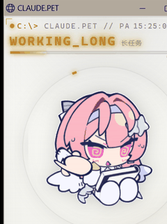

# ClaudePet · 桌面桌宠

一个**无边框真透明悬浮球**桌面宠物，实时反映 **Claude Code CLI** 的工作状态——思考、工作中、长任务、完成、待命、离线、异常。赛博朋克 HUD，可切换主题、缩放字号、调节透明度、置顶、拖动，配置持久化。

- **悬浮球**：平时仅一个可拖动的圆环+图片+状态字；左键/悬停展开全面板；右键弹中心对称透明气泡菜单。
- **无边框宿主**：WinForms + WebView2 真透明、置顶、无标题栏/最小化/关闭按钮（WebView2 运行时 Win10/11 自带）。
- **零外部依赖**：Node.js 内置模块 HTTP 服务 + 系统自带 PowerShell + WebView2 运行时。
- **赛博朋克 HUD**：Cascadia Code + 霓虹扫描线，GIF 状态随工作实时切换（≤1s）。
- **4 套主题**：赛博霓虹（默认）/ 极简白 / 终端绿 / 暗金 OLED，一键循环切换。
- **字体缩放 / 透明度**：右上角 `−`/`+` 缩放字号（0.85–1.35）；气泡调透明度（真透视淡出）。
- **置顶 + 记忆位置**：始终置顶可关；窗口位置/大小/透明度/主题/字号全部持久化，重开恢复。
- **"现在在做什么"**：面板实时显示 claude 当前动作；长任务完成/报错有提示音提醒。
- **即装即用**：`install.bat` 一键安装，`start-both.bat` 同时拉起 claude 终端和悬浮球。




## 快速开始

**要求**：Windows 10/11 · Node.js ≥ 18 · Claude Code CLI · Microsoft Edge（Win10/11 自带）

```bat
:: 1) 解压安装包，双击 install.bat（自动自检 + 复制到 %LOCALAPPDATA%\ClaudePet + 建快捷方式）
:: 2) 双击桌面 "Claude Pet" 快捷方式
::    → 终端里启动 claude + 右下角出现桌宠窗
:: 3) 关闭终端 → 桌宠 5s 内自动退出
```

详细说明见 [docs/INSTALL.md](docs/INSTALL.md) 与 [docs/CONFIG.md](docs/CONFIG.md)。

## 状态一览

| 状态 | 含义 | GIF |
|---|---|---|
| THINKING | 刚有活动（<5s） | thinking.gif |
| WORKING | 持续工作中（<30s） | working.gif |
| WORKING LONG | 长任务（>30s） | workinglong.gif |
| DONE | 一次任务刚完成（闪 5s） | done.gif |
| IDLE | 安静待命 | offlineandidle.gif |
| OFFLINE | 未检测到 claude 进程 | offlineandidle.gif |
| ERROR | 最近 30s 内工具报错 | errorandwaityou.gif |

状态推断读取最新转录消息内容分类（而非文件 mtime），流式输出期间也能正确显示"工作中"。

## 主题

点"主题"按钮或按 `T` 循环切换，`localStorage` + `config.json` 持久化，默认 `cyber`：

| 主题 | 风格 |
|---|---|
| cyber（默认） | 赛博霓虹：深蓝底 + 青/品红发光 + 扫描线 |
| paper | 极简白：米白底、近黑文字、发丝边框、无强发光 |
| matrix | 终端绿：纯黑底 + 荧光绿磷光 + 绿扫描线 |
| gold | 暗金 OLED：纯黑底 + 香槟金描边、内敛发光 |

## 交互与功能

| 操作 | 作用 |
|---|---|
| 拖动悬浮球 | 移动桌宠位置（记住） |
| 左键 / 悬停 ~350ms | 球 → 展开全面板；`⇲` 收起回球 |
| 右键球 | 弹出中心对称透明气泡菜单（主题/终端/置顶/透明度±/退出） |
| `T` | 循环切换 4 套主题 |
| 右上 `−` / `+`（或 `-` / `=`） | 整体缩放字号与 UI（0.85–1.35） |
| 气泡 透明度± | 调节窗口透明度（真透视） |
| 气泡 置顶 | 置顶开关 |
| `D` | 循环强制各状态（验 GIF 用） |
| 双击面板桌宠 | 聚焦 claude 终端 |
| `Esc` / 退出 | 关闭悬浮球与服务（配置已先保存） |

## 配置持久化

- **主题 + 字号**：客户端 `localStorage` + 服务端 `app/config.json` 双保险。
- **窗口位置/大小/透明度/置顶**：宿主 `app/host.json`。
- 关闭/退出前（`beforeunload`）自动再存一次，重开全部恢复。

## 开发

悬浮球宿主构建见 [docs/HOST.md](docs/HOST.md)。架构与 API 见 [docs/DESIGN.md](docs/DESIGN.md)、[docs/CONFIG.md](docs/CONFIG.md)。给 AI 协作者的约定见 [CLAUDE.md](CLAUDE.md)。版本变更见 [CHANGELOG.md](CHANGELOG.md)。

## 许可

MIT，见 [LICENSE](LICENSE)。
